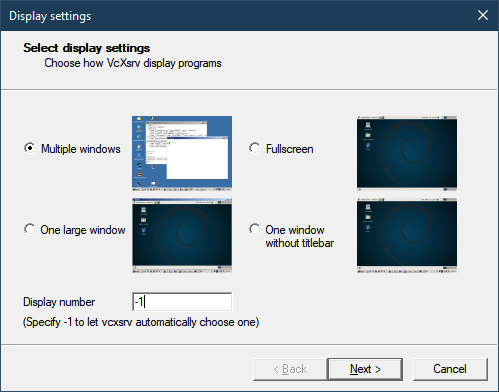
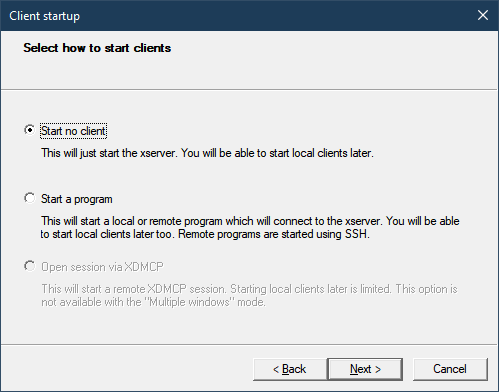
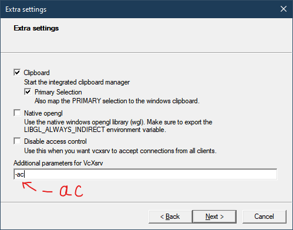
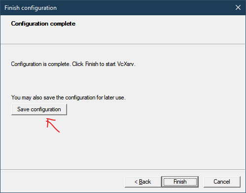

# Visual SLAM Workshop at Kyoto University 2022

## Getting Started

### 0. ONLY FOR WINDOWS USERS - Install Windows Sybsystem for Linux (WSL)

Follow the official instructions [here](https://docs.microsoft.com/en-us/windows/wsl/install) to install WSL2 and Ubuntu 20.04 LTS.

**Note**: Windows users are encouraged to install [Windows Terminal](https://apps.microsoft.com/store/detail/windows-terminal/9N0DX20HK701?hl=ja-jp&gl=JP). You still can use PowerShell, but it does not look that convenient.

The result should look like this: Ubuntu 20.04 in Windows Terminal.

<p align="center">
  
</p>

### 1. Install Docker

**Note**: Docker helps us to build a virtual environment with all the required dependencies for running our programs. 

Choose your OS and follow the instructions:

- Ubuntu: https://docs.docker.com/desktop/install/ubuntu
- Mac OS: https://docs.docker.com/desktop/install/mac-install
- Windows: https://docs.docker.com/desktop/install/windows-install

Go to Docker settings and enable WSL2 backend (see below).

<p align="center">
  
</p>

### 2. Configure X Window System

X Window System (or X11) is a system for remote graphical interfaces rendering and control.

It allows to forward graphics from WSL2/Docker to Host machine.

There are several options depending on OS:
- Mac OS: https://www.xquartz.org
- Windows: VcXsrv ([link](https://sourceforge.net/projects/vcxsrv/files/vcxsrv/1.20.14.0/vcxsrv-64.1.20.14.0.installer.exe/download) to download)
- Ubuntu: `sudo apt-get -y install xserver-xorg`

**Example**: VcXsrv configuration on Windows (see below, from left to right, up to bottom).

<p align="center">
  
  
</p>

<p align="center">
  
  
</p>

**Note**: it is recommended to save the X11 configuration, so that after reboot one can just click on the saved configuration to start X11 without going through the configuration steps once again.  

### 3. Clone this repo

```shell
git clone https://github.com/Robotics-Tutorials/vslam-workshop-kyoto-university.git
```

or download a ZIP archive (click [here](https://github.com/Robotics-Tutorials/vslam-workshop-kyoto-university/archive/refs/heads/master.zip)).

### 3. Docker image

Build it from source:
```shell
cd path/to/vslam-workshop-kyoto-university
chmod +x docker/build_docker.sh
./docker/build_docker.sh
```

or pull it from the Docker Hub:
```shell
docker pull chupakabra1996/orb-slam2
```

### 4. Prepare datasets

Datasets can be downloaded [here](https://projects.asl.ethz.ch/datasets/doku.php?id=kmavvisualinertialdatasets).

In this workshop we will use [`Vicon Room 1 01`](http://robotics.ethz.ch/~asl-datasets/ijrr_euroc_mav_dataset/machine_hall/MH_01_easy/MH_01_easy.bag) and [`Machine Hall 01`](http://robotics.ethz.ch/~asl-datasets/ijrr_euroc_mav_dataset/vicon_room1/V1_01_easy/V1_01_easy.bag) ROS bag files.

Put the downloaded ROS bag files inside the `datasets` folder.

After this step there should be 2 files: `datasets/MH_01_easy.bag` and  `datasets/V1_01_easy.bag`

### 5. Run SLAM

Run the Docker container:
```shell
chmod +x docker/run_docker.sh
./docker/run_docker.sh
```

**Note**: set the `DISPLAY` env variables correctly beforehand. The script sets `DISPLAY` if it's missing, but it could be an incorrect value.

`DISPLAY` should be a value of format `x.x.x.x:y` where `x.x.x.x` - IP address of the Host, `y` - display number (by default: 0).

**Example** (setting env variable in the terminal): `export DISPLAY=192.168.0.3:0`.

**THE FOLLOWING INSTRUCTIONS SHOULD BE DONE INSIDE THE CONTAINER!!!**

Reindex all the ROS bag files:
```shell
rosbag reindex datasets/<bag file>
```

(MH - optional argument to use MH dataset)

A. Launch monocular Visual SLAM (using EuRoC dataset):
```shell
./scripts/run_mono_euroc.sh [MH]
```

B. Launch Stereo Visual SLAM (using EuRoC dataset):
```shell
./scripts/run_stereo_euroc.sh [MH]
```
